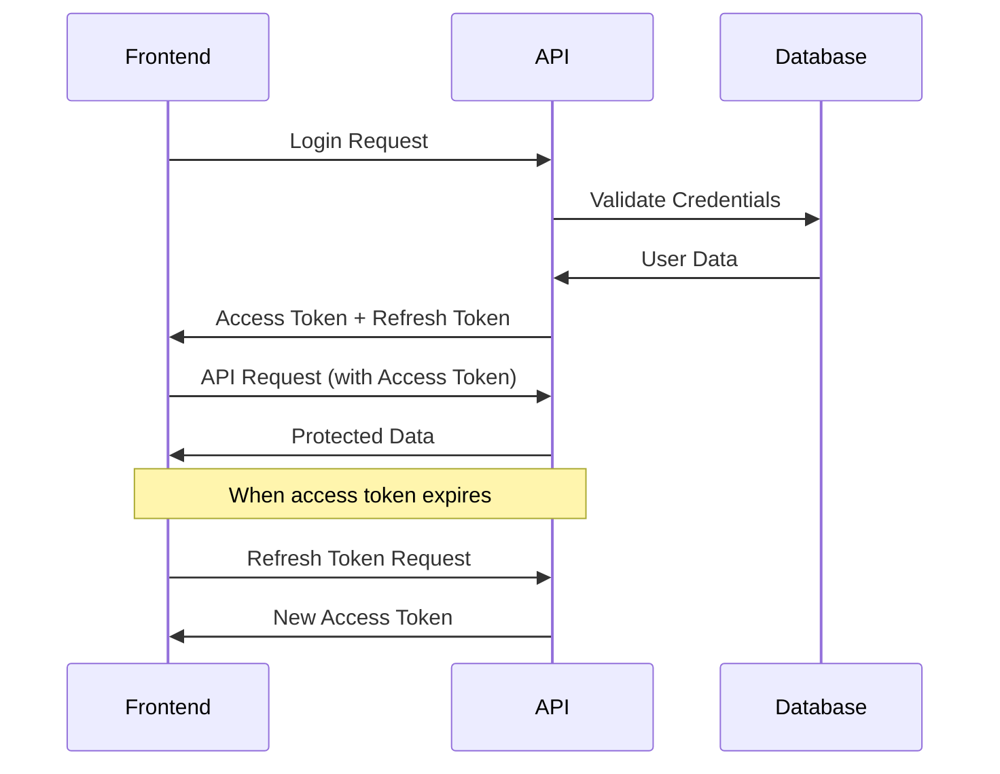

# MegaPaints Backend API - Frontend Developer Documentation

## 🚀 Overview

This documentation provides comprehensive information for frontend developers to integrate with the MegaPaints Backend API. The API supports both **Admin Panel** and **User Portal** with separate authentication systems.

**Base URL**: `http://localhost:3000`

## 📋 Table of Contents

1. [Authentication System](#authentication-system)
2. [Admin APIs](#admin-apis)
3. [User APIs](#user-apis)
4. [Error Handling](#error-handling)
5. [Security Considerations](#security-considerations)
6. [Code Examples](#code-examples)

---

## 🔐 Authentication System

### Login Flexibility
Both **User** and **Admin** login endpoints use the `username` field, which accepts:
- ✅ **Username** (e.g., `john_doe`, `Admin`)
- ✅ **Email Address** (e.g., `john@example.com`, `admin@megapaints.com`)

This provides flexibility for users to login with either their username or email address.

### JWT Token Structure

The API uses **JWT (JSON Web Tokens)** for authentication with separate systems for users and admins.

#### Token Types
- **Access Token**: Short-lived (15 minutes) - used for API requests
- **Refresh Token**: Long-lived (7 days) - used to get new access tokens

#### Token Storage
Tokens are provided in **two ways**:
1. **Response body** - for client-side storage
2. **HTTP-only cookies** - for enhanced security

### Authentication Flow



---

## 👨‍💼 Admin APIs

### Admin Authentication

#### 1. Admin Login
**POST** `/api/auth/admin/login`

**Request Body:**
```json
{
  "username": "Admin",
  "password": "1"
}
```

**Note:** The `username` field accepts both username and email address for login.

**Response (Success):**
```json
{
  "status": "success",
  "message": "Admin login successful",
  "data": {
    "admin": {
      "_id": "68d2bcf322e5515f73468f0c",
      "username": "Admin",
      "email": "admin@megapaints.com",
      "first_name": "System",
      "last_name": "Administrator",
      "designation": "Super Admin",
      "roles": ["admin", "super_admin"],
      "permissions": [
        "products:read", "products:create", "products:update", "products:delete",
        "branches:read", "branches:create", "branches:update", "branches:delete",
        "users:read", "users:create", "users:update", "users:delete",
        "inventory:read", "inventory:create", "inventory:update", "inventory:delete",
        "analytics:read", "analytics:create", "analytics:update", "analytics:delete",
        "settings:read", "settings:create", "settings:update", "settings:delete"
      ],
      "branches": [],
      "last_login": "2025-09-23T15:37:05.454Z"
    },
    "tokens": {
      "accessToken": "eyJhbGciOiJIUzI1NiIsInR5cCI6IkpXVCJ9...",
      "refreshToken": "eyJhbGciOiJIUzI1NiIsInR5cCI6IkpXVCJ9...",
      "expiresIn": "15m"
    }
  }
}
```

**JavaScript Example:**
```javascript
const adminLogin = async (username, password) => {
  try {
    const response = await fetch('/api/auth/admin/login', {
      method: 'POST',
      headers: {
        'Content-Type': 'application/json',
      },
      credentials: 'include', // Include cookies
      body: JSON.stringify({ username, password })
    });

    const data = await response.json();
    
    if (data.status === 'success') {
      // Store tokens
      localStorage.setItem('adminAccessToken', data.data.tokens.accessToken);
      localStorage.setItem('adminRefreshToken', data.data.tokens.refreshToken);
      localStorage.setItem('adminUser', JSON.stringify(data.data.admin));
      
      return data.data;
    } else {
      throw new Error(data.message);
    }
  } catch (error) {
    console.error('Admin login failed:', error);
    throw error;
  }
};
```

#### 2. Admin Refresh Token
**POST** `/api/auth/admin/refresh`

**Request Body:**
```json
{
  "refreshToken": "eyJhbGciOiJIUzI1NiIsInR5cCI6IkpXVCJ9..."
}
```

**Response:**
```json
{
  "status": "success",
  "message": "Admin token refreshed successfully",
  "data": {
    "tokens": {
      "accessToken": "eyJhbGciOiJIUzI1NiIsInR5cCI6IkpXVCJ9...",
      "refreshToken": "eyJhbGciOiJIUzI1NiIsInR5cCI6IkpXVCJ9...",
      "expiresIn": "15m"
    }
  }
}
```

#### 3. Admin Logout
**POST** `/api/auth/admin/logout`

**Headers:** `Authorization: Bearer <access_token>`

**Response:**
```json
{
  "status": "success",
  "message": "Admin logout successful"
}
```

#### 4. Get Current Admin Profile
**GET** `/api/auth/admin/me`

**Headers:** `Authorization: Bearer <access_token>`

**Response:**
```json
{
  "status": "success",
  "data": {
    "admin": {
      "_id": "68d2bcf322e5515f73468f0c",
      "username": "Admin",
      "email": "admin@megapaints.com",
      "first_name": "System",
      "last_name": "Administrator",
      "roles": ["admin", "super_admin"],
      "permissions": [...],
      "is_active": true,
      "last_login": "2025-09-23T15:37:05.454Z"
    }
  }
}
```

#### 5. Request Password Change OTP
**POST** `/api/auth/admin/request-password-change`

**Headers:** `Authorization: Bearer <access_token>`

**Response:**
```json
{
  "status": "success",
  "message": "OTP sent successfully",
  "details": "Please check your email for the OTP to change your password"
}
```

#### 6. Change Admin Password (with OTP)
**POST** `/api/auth/admin/change-password`

**Headers:** `Authorization: Bearer <access_token>`

**Request Body:**
```json
{
  "otp": "123456",
  "newPassword": "newSecurePassword123!"
}
```

**Response:**
```json
{
  "status": "success",
  "message": "Password changed successfully",
  "details": "Please login again with your new password"
}
```

### Admin Product Management

#### 1. Get Product Categories
**GET** `/api/admin/products/categories`

**Headers:** `Authorization: Bearer <access_token>`

**Query Parameters:**
- `page` (optional): Page number (default: 1)
- `limit` (optional): Items per page (default: 20, max: 100)
- `search` (optional): Search term
- `parent_id` (optional): Filter by parent category ID
- `is_active` (optional): Filter by active status (true/false)

**Response:**
```json
{
  "status": "success",
  "data": {
    "categories": [
      {
        "_id": "68d2bcf322e5515f73468f28",
        "name": "Paints",
        "description": "All types of paint products",
        "parent_id": null,
        "sort_order": 1,
        "is_active": true,
        "createdAt": "2025-09-23T15:29:55.651Z",
        "updatedAt": "2025-09-23T15:29:55.651Z"
      }
    ],
    "pagination": {
      "page": 1,
      "limit": 20,
      "total": 10,
      "pages": 1
    }
  }
}
```

#### 2. Create Product Category
**POST** `/api/admin/products/categories`

**Headers:** `Authorization: Bearer <access_token>`

**Request Body:**
```json
{
  "name": "Interior Paints",
  "description": "Paints for interior walls and surfaces",
  "parent_id": "68d2bcf322e5515f73468f28",
  "image_url": "https://example.com/image.jpg",
  "sort_order": 1,
  "is_active": true
}
```

#### 3. Get Products
**GET** `/api/admin/products`

**Headers:** `Authorization: Bearer <access_token>`

**Query Parameters:**
- `page`, `limit`, `search` (same as categories)
- `category_id` (optional): Filter by category
- `product_type` (optional): paint, additive, binder, auxiliary, accessory, third_party
- `is_active` (optional): Filter by active status

**Response:**
```json
{
  "status": "success",
  "data": {
    "products": [
      {
        "_id": "68d2bcf322e5515f73468f30",
        "name": "Premium White Paint",
        "code": "PWP-001",
        "description": "High-quality white paint for interior use",
        "category": {
          "_id": "68d2bcf322e5515f73468f28",
          "name": "Paints"
        },
        "product_type": "paint",
        "base_price": 150.00,
        "unit": "liter",
        "is_active": true,
        "inventory_summary": {
          "total_stock": 0,
          "available_branches": 0,
          "low_stock_branches": 0,
          "out_of_stock_branches": 0
        },
        "createdAt": "2025-09-23T15:29:55.651Z"
      }
    ],
    "pagination": {
      "page": 1,
      "limit": 20,
      "total": 0,
      "pages": 0
    }
  }
}
```

#### 4. Create Product
**POST** `/api/admin/products`

**Headers:** `Authorization: Bearer <access_token>`

**Request Body:**
```json
{
  "name": "Premium White Paint",
  "code": "PWP-001",
  "description": "High-quality white paint for interior use",
  "category_id": "68d2bcf322e5515f73468f28",
  "subcategory_id": "68d2bcf322e5515f73468f29",
  "product_type": "paint",
  "base_price": 150.00,
  "unit": "liter",
  "weight": 2.5,
  "volume": 1.0,
  "color_code": "#FFFFFF",
  "specifications": {
    "finish": "matte",
    "coverage": "12 sqm/liter"
  },
  "images": [
    {
      "url": "https://example.com/product1.jpg",
      "alt_text": "Product main image",
      "is_primary": true,
      "sort_order": 1
    }
  ],
  "is_active": true
}
```

### Admin Business Management

#### 1. Get Branches
**GET** `/api/admin/business/branches`

**Headers:** `Authorization: Bearer <access_token>`

**Query Parameters:**
- `page`, `limit`, `search`, `is_active` (same as other endpoints)

**Response:**
```json
{
  "status": "success",
  "data": {
    "branches": [
      {
        "_id": "68d2bcf322e5515f73468f21",
        "name": "Main Branch",
        "code": "MAIN",
        "address": {
          "street": "123 Main Street",
          "city": "Mumbai",
          "state": "Maharashtra",
          "pincode": "400001",
          "country": "India"
        },
        "phone": "+91-22-12345678",
        "email": "main@megapaints.com",
        "is_active": true,
        "inventory_summary": {
          "total_products": 0,
          "total_stock_value": 0,
          "low_stock_count": 0,
          "out_of_stock_count": 0
        },
        "low_stock_products": 0,
        "createdAt": "2025-09-23T15:29:55.601Z"
      }
    ],
    "pagination": {
      "page": 1,
      "limit": 20,
      "total": 1,
      "pages": 1
    }
  }
}
```

#### 2. Create Branch
**POST** `/api/admin/business/branches`

**Headers:** `Authorization: Bearer <access_token>`

**Request Body:**
```json
{
  "name": "Mumbai Branch",
  "code": "MUM-001",
  "address": {
    "street": "123 Business Street",
    "city": "Mumbai",
    "state": "Maharashtra",
    "pincode": "400001",
    "country": "India"
  },
  "phone": "+91-22-12345678",
  "email": "mumbai@megapaints.com",
  "manager_id": "68d2bcf322e5515f73468f0c",
  "is_active": true
}
```

#### 3. Get Users
**GET** `/api/admin/business/users`

**Headers:** `Authorization: Bearer <access_token>`

**Query Parameters:**
- `page`, `limit`, `search`, `is_active` (same as other endpoints)
- `designation` (optional): Filter by user designation
- `branch_id` (optional): Filter by branch

**Response:**
```json
{
  "status": "success",
  "data": {
    "users": [
      {
        "_id": "68d2bcf322e5515f73468f0c",
        "username": "Admin",
        "email": "admin@megapaints.com",
        "first_name": "System",
        "last_name": "Administrator",
        "designation": "Super Admin",
        "roles": ["admin", "super_admin"],
        "permissions": [...],
        "branches": [],
        "is_active": true,
        "last_login": "2025-09-23T15:41:23.812Z",
        "createdAt": "2025-09-23T15:29:55.357Z"
      }
    ],
    "pagination": {
      "page": 1,
      "limit": 20,
      "total": 1,
      "pages": 1
    }
  }
}
```

#### 4. Create User
**POST** `/api/admin/business/users`

**Headers:** `Authorization: Bearer <access_token>`

**Request Body:**
```json
{
  "username": "john_doe",
  "email": "john@megapaints.com",
  "password": "password123",
  "first_name": "John",
  "last_name": "Doe",
  "phone": "+91-98765-43210",
  "designation": "Branch Manager",
  "roles": ["manager"],
  "branches": ["68d2bcf322e5515f73468f21"],
  "permissions": ["products:read", "inventory:read", "inventory:update"],
  "is_active": true
}
```

#### 5. Update User
**PUT** `/api/admin/business/users/:id`

**Headers:** `Authorization: Bearer <access_token>`

**Request Body:** (same as create, but all fields are optional)
```json
{
  "first_name": "John Updated",
  "designation": "Senior Manager",
  "is_active": false
}
```

---

## 👤 User APIs

### User Authentication

#### 1. User Registration
**POST** `/api/auth/user/register`

**Request Body:**
```json
{
  "username": "john_doe",
  "email": "john@example.com",
  "password": "password123",
  "first_name": "John",
  "last_name": "Doe",
  "phone": "+1-555-123-4567",
  "company": "Test Company",
  "designation": "Developer"
}
```

**Response (Success):**
```json
{
  "status": "success",
  "message": "User registered successfully",
  "data": {
    "user": {
      "_id": "68d2cafbbc474bb92a425543",
      "username": "john_doe",
      "email": "john@example.com",
      "first_name": "John",
      "last_name": "Doe",
      "phone": "+1-555-123-4567",
      "company": "Test Company",
      "designation": "Developer",
      "is_active": true,
      "created_at": "2025-09-23T16:29:47.870Z"
    }
  }
}
```

**Response (Error - User Exists):**
```json
{
  "status": "error",
  "code": 400,
  "message": "User already exists",
  "details": "A user with this username already exists"
}
```

**Response (Error - Validation):**
```json
{
  "status": "error",
  "code": 400,
  "message": "Validation failed",
  "details": [
    "Username is required",
    "Username must be at least 3 characters",
    "Valid email is required",
    "Password must be at least 6 characters",
    "First name is required",
    "Last name is required"
  ]
}
```

**Field Requirements:**
- `username`: Required, minimum 3 characters, must be unique
- `email`: Required, valid email format, must be unique
- `password`: Required, minimum 6 characters
- `first_name`: Required
- `last_name`: Required
- `phone`: Optional, any format
- `company`: Optional
- `designation`: Optional

**JavaScript Example:**
```javascript
const userRegister = async (userData) => {
  try {
    const response = await fetch('/api/auth/user/register', {
      method: 'POST',
      headers: {
        'Content-Type': 'application/json',
      },
      body: JSON.stringify(userData)
    });

    const data = await response.json();
    
    if (data.status === 'success') {
      console.log('User registered successfully:', data.data.user);
      return data.data;
    } else {
      throw new Error(data.message);
    }
  } catch (error) {
    console.error('Registration failed:', error);
    throw error;
  }
};

// Usage
try {
  const newUser = await userRegister({
    username: "john_doe",
    email: "john@example.com",
    password: "password123",
    first_name: "John",
    last_name: "Doe",
    phone: "+1-555-123-4567",
    company: "Test Company",
    designation: "Developer"
  });
  // Redirect to login or auto-login
} catch (error) {
  // Handle registration error
  alert(error.message);
}
```

#### 2. User Login
**POST** `/api/auth/user/login`

**Request Body:**
```json
{
  "username": "john_doe",
  "password": "password123"
}
```

**Note:** The `username` field accepts both username and email address for login.

**Response:**
```json
{
  "status": "success",
  "message": "Login successful",
  "data": {
    "user": {
      "_id": "68d2bcf322e5515f73468f10",
      "username": "john_doe",
      "email": "john@megapaints.com",
      "first_name": "John",
      "last_name": "Doe",
      "designation": "Branch Manager",
      "roles": ["manager"],
      "permissions": ["products:read", "inventory:read"],
      "branches": ["68d2bcf322e5515f73468f21"],
      "last_login": "2025-09-23T15:45:00.000Z"
    },
    "tokens": {
      "accessToken": "eyJhbGciOiJIUzI1NiIsInR5cCI6IkpXVCJ9...",
      "refreshToken": "eyJhbGciOiJIUzI1NiIsInR5cCI6IkpXVCJ9...",
      "expiresIn": "15m"
    }
  }
}
```

#### 2. User Refresh Token
**POST** `/api/auth/user/refresh`

**Request Body:**
```json
{
  "refreshToken": "eyJhbGciOiJIUzI1NiIsInR5cCI6IkpXVCJ9..."
}
```

#### 3. User Logout
**POST** `/api/auth/user/logout`

**Headers:** `Authorization: Bearer <access_token>`

#### 4. Get Current User Profile
**GET** `/api/auth/user/me`

**Headers:** `Authorization: Bearer <access_token>`

#### 5. Change User Password
**POST** `/api/auth/user/change-password`

**Headers:** `Authorization: Bearer <access_token>`

**Request Body:**
```json
{
  "currentPassword": "oldPassword123",
  "newPassword": "newPassword456"
}
```

### User Dashboard

#### 1. Get Dashboard Data
**GET** `/api/user/dashboard`

**Headers:** `Authorization: Bearer <access_token>`

**Response:**
```json
{
  "status": "success",
  "message": "User dashboard endpoint - Coming soon",
  "data": {
    "user": {
      "_id": "68d2bcf322e5515f73468f10",
      "username": "john_doe",
      "branches": ["68d2bcf322e5515f73468f21"]
    },
    "message": "User dashboard functionality will be implemented in the next phase"
  }
}
```

### User Management APIs

#### 1. Get All Users (Admin Only) - Direct Route
**GET** `/api/admin/users`

**Headers:** `Authorization: Bearer <access_token>`

**Query Parameters:**
- `page` (optional): Page number (default: 1)
- `limit` (optional): Items per page (default: 20, max: 100)
- `search` (optional): Search term for username, email, first_name, last_name
- `is_active` (optional): Filter by active status (true/false)
- `designation` (optional): Filter by user designation
- `branch_id` (optional): Filter by branch ID

**Response:**
```json
{
  "status": "success",
  "data": {
    "users": [
      {
        "_id": "68d2cafbbc474bb92a425543",
        "username": "john_doe",
        "email": "john@example.com",
        "first_name": "John",
        "last_name": "Doe",
        "phone": "+1-555-123-4567",
        "company": "Test Company",
        "designation": "Developer",
        "roles": ["user"],
        "permissions": ["products:read", "inventory:read"],
        "branches": [],
        "is_active": true,
        "tokenVersion": 1,
        "createdAt": "2025-09-23T16:29:47.870Z",
        "updatedAt": "2025-09-23T17:13:43.045Z",
        "last_login": "2025-09-23T17:13:43.045Z"
      }
    ],
    "pagination": {
      "page": 1,
      "limit": 10,
      "total": 5,
      "pages": 1
    }
  }
}
```

**JavaScript Example:**
```javascript
const getUsers = async (page = 1, limit = 10, search = '') => {
  try {
    const params = new URLSearchParams({
      page: page.toString(),
      limit: limit.toString(),
      ...(search && { search })
    });

    const response = await fetch(`/api/admin/users?${params}`, {
      headers: {
        'Authorization': `Bearer ${localStorage.getItem('adminAccessToken')}`
      }
    });

    const data = await response.json();
    
    if (data.status === 'success') {
      return data.data;
    } else {
      throw new Error(data.message);
    }
  } catch (error) {
    console.error('Failed to fetch users:', error);
    throw error;
  }
};

// Usage
try {
  const usersData = await getUsers(1, 10, 'john');
  console.log('Users:', usersData.users);
  console.log('Pagination:', usersData.pagination);
} catch (error) {
  console.error('Error:', error.message);
}
```

#### 2. Get All Users (Admin Only) - Business Route
**GET** `/api/admin/business/users`

**Headers:** `Authorization: Bearer <access_token>`

**Query Parameters:**
- `page` (optional): Page number (default: 1)
- `limit` (optional): Items per page (default: 20, max: 100)
- `search` (optional): Search term for username, email, first_name, last_name
- `is_active` (optional): Filter by active status (true/false)
- `designation` (optional): Filter by user designation
- `branch_id` (optional): Filter by branch ID

**Response:**
```json
{
  "status": "success",
  "data": {
    "users": [
      {
        "_id": "68d2cafbbc474bb92a425543",
        "username": "john_doe",
        "email": "john@example.com",
        "first_name": "John",
        "last_name": "Doe",
        "phone": "+1-555-123-4567",
        "company": "Test Company",
        "designation": "Developer",
        "roles": ["user"],
        "permissions": ["products:read", "inventory:read"],
        "branches": [],
        "is_active": true,
        "last_login": "2025-09-23T17:13:38.183Z",
        "createdAt": "2025-09-23T16:29:47.870Z",
        "updatedAt": "2025-09-23T16:29:47.870Z"
      }
    ],
    "pagination": {
      "page": 1,
      "limit": 20,
      "total": 1,
      "pages": 1
    }
  }
}
```

#### 2. Create User (Admin Only)
**POST** `/api/admin/business/users`

**Headers:** `Authorization: Bearer <access_token>`

**Request Body:**
```json
{
  "username": "jane_smith",
  "email": "jane@megapaints.com",
  "password": "password123",
  "first_name": "Jane",
  "last_name": "Smith",
  "phone": "+91-98765-43210",
  "company": "MegaPaints",
  "designation": "Branch Manager",
  "roles": ["manager"],
  "branches": ["68d2bcf322e5515f73468f21"],
  "permissions": ["products:read", "inventory:read", "inventory:update"],
  "is_active": true
}
```

**Response:**
```json
{
  "status": "success",
  "message": "User created successfully",
  "data": {
    "user": {
      "_id": "68d2cafbbc474bb92a425544",
      "username": "jane_smith",
      "email": "jane@megapaints.com",
      "first_name": "Jane",
      "last_name": "Smith",
      "phone": "+91-98765-43210",
      "company": "MegaPaints",
      "designation": "Branch Manager",
      "roles": ["manager"],
      "permissions": ["products:read", "inventory:read", "inventory:update"],
      "branches": ["68d2bcf322e5515f73468f21"],
      "is_active": true,
      "createdAt": "2025-09-23T17:30:00.000Z"
    }
  }
}
```

#### 3. Update User (Admin Only)
**PUT** `/api/admin/business/users/:id`

**Headers:** `Authorization: Bearer <access_token>`

**Request Body:** (All fields are optional)
```json
{
  "first_name": "Jane Updated",
  "designation": "Senior Manager",
  "permissions": ["products:read", "products:create", "inventory:read", "inventory:update"],
  "is_active": true
}
```

**Response:**
```json
{
  "status": "success",
  "message": "User updated successfully",
  "data": {
    "user": {
      "_id": "68d2cafbbc474bb92a425544",
      "username": "jane_smith",
      "email": "jane@megapaints.com",
      "first_name": "Jane Updated",
      "last_name": "Smith",
      "designation": "Senior Manager",
      "permissions": ["products:read", "products:create", "inventory:read", "inventory:update"],
      "is_active": true,
      "updatedAt": "2025-09-23T17:35:00.000Z"
    }
  }
}
```

#### 4. Get User by ID (Admin Only)
**GET** `/api/admin/business/users/:id`

**Headers:** `Authorization: Bearer <access_token>`

**Response:**
```json
{
  "status": "success",
  "data": {
    "user": {
      "_id": "68d2cafbbc474bb92a425543",
      "username": "john_doe",
      "email": "john@example.com",
      "first_name": "John",
      "last_name": "Doe",
      "phone": "+1-555-123-4567",
      "company": "Test Company",
      "designation": "Developer",
      "roles": ["user"],
      "permissions": ["products:read", "inventory:read"],
      "branches": [],
      "is_active": true,
      "last_login": "2025-09-23T17:13:38.183Z",
      "createdAt": "2025-09-23T16:29:47.870Z",
      "updatedAt": "2025-09-23T16:29:47.870Z"
    }
  }
}
```

### User Profile Management

#### 1. Get Current User Profile
**GET** `/api/auth/user/me`

**Headers:** `Authorization: Bearer <access_token>`

**Response:**
```json
{
  "status": "success",
  "data": {
    "user": {
      "_id": "68d2cafbbc474bb92a425543",
      "username": "john_doe",
      "email": "john@example.com",
      "first_name": "John",
      "last_name": "Doe",
      "phone": "+1-555-123-4567",
      "company": "Test Company",
      "designation": "Developer",
      "roles": ["user"],
      "permissions": ["products:read", "inventory:read"],
      "branches": [],
      "is_active": true,
      "last_login": "2025-09-23T17:13:38.183Z",
      "createdAt": "2025-09-23T16:29:47.870Z"
    }
  }
}
```

#### 2. Update User Profile
**PUT** `/api/auth/user/profile`

**Headers:** `Authorization: Bearer <access_token>`

**Request Body:** (All fields are optional)
```json
{
  "first_name": "John Updated",
  "last_name": "Doe Updated",
  "phone": "+1-555-999-8888",
  "company": "New Company",
  "designation": "Senior Developer"
}
```

**Response:**
```json
{
  "status": "success",
  "message": "Profile updated successfully",
  "data": {
    "user": {
      "_id": "68d2cafbbc474bb92a425543",
      "username": "john_doe",
      "email": "john@example.com",
      "first_name": "John Updated",
      "last_name": "Doe Updated",
      "phone": "+1-555-999-8888",
      "company": "New Company",
      "designation": "Senior Developer",
      "roles": ["user"],
      "permissions": ["products:read", "inventory:read"],
      "branches": [],
      "is_active": true,
      "updatedAt": "2025-09-23T17:40:00.000Z"
    }
  }
}
```

### Missing Endpoints (Coming Soon)

The following endpoints are **not yet implemented** but may be requested by the frontend:

#### Board Management APIs
- `GET /api/board/v2/board/branch` - Get branch-specific board data
- `GET /api/board/v2/labels` - Get board labels
- `GET /api/board` - Get board data
- `POST /api/board` - Create board
- `PUT /api/board/:id` - Update board
- `DELETE /api/board/:id` - Delete board

#### Label Management APIs
- `GET /api/label` - Get labels
- `POST /api/label` - Create label
- `PUT /api/label/:id` - Update label
- `DELETE /api/label/:id` - Delete label

#### User Management APIs (Alternative Routes)
- `GET /api/users` - Get users (alternative route)
- `GET /api/auth/users` - Get users (alternative route)

**Note:** These endpoints will return 404 errors until implemented. The frontend should handle these gracefully or use the available admin user management endpoints instead.

---

## 🏥 Health Check APIs

#### 1. Basic Health Check
**GET** `/health`

**Response:**
```json
{
  "status": "UP",
  "timestamp": "2025-09-23T15:40:28.056Z",
  "uptime": 211.819648458,
  "environment": "development",
  "version": "1.0.0"
}
```

#### 2. Detailed Health Check
**GET** `/health/detailed`

**Response:**
```json
{
  "status": "UP",
  "timestamp": "2025-09-23T15:40:28.056Z",
  "uptime": 211.819648458,
  "environment": "development",
  "version": "1.0.0",
  "services": {
    "database": {
      "status": "UP",
      "state": "connected",
      "host": "localhost",
      "port": 27017,
      "name": "megapaints_admin",
      "ping": "OK"
    },
    "memory": {
      "status": "UP",
      "rss": "77 MB",
      "heapTotal": "34 MB",
      "heapUsed": "31 MB",
      "external": "20 MB"
    }
  }
}
```

---

## ❌ Error Handling

### Error Response Format

All errors follow a consistent format:

```json
{
  "status": "error",
  "code": 400,
  "message": "Validation failed",
  "details": ["Name is required", "Email format is invalid"]
}
```

### Common HTTP Status Codes

- **200**: Success
- **201**: Created successfully
- **400**: Bad Request (validation errors)
- **401**: Unauthorized (invalid/expired token)
- **403**: Forbidden (insufficient permissions)
- **404**: Not Found
- **429**: Too Many Requests (rate limiting)
- **500**: Internal Server Error

### Error Types

#### Authentication Errors
```json
{
  "status": "error",
  "code": 401,
  "message": "Token expired",
  "details": "Please refresh your token or login again"
}
```

#### Validation Errors
```json
{
  "status": "error",
  "code": 400,
  "message": "Validation failed",
  "details": [
    "Name is required",
    "Email format is invalid",
    "Password must be at least 6 characters"
  ]
}
```

#### Permission Errors
```json
{
  "status": "error",
  "code": 403,
  "message": "Insufficient permissions",
  "details": "Required permissions: products:create"
}
```

---

## 🔒 Security Considerations

### 1. Token Management

**Best Practices:**
```javascript
// Store tokens securely
const storeTokens = (accessToken, refreshToken) => {
  // Option 1: localStorage (less secure but convenient)
  localStorage.setItem('accessToken', accessToken);
  localStorage.setItem('refreshToken', refreshToken);
  
  // Option 2: Secure HTTP-only cookies (more secure)
  // Tokens are automatically stored in cookies by the server
};

// Auto-refresh tokens
const apiCall = async (url, options = {}) => {
  let accessToken = localStorage.getItem('accessToken');
  
  try {
    const response = await fetch(url, {
      ...options,
      headers: {
        ...options.headers,
        'Authorization': `Bearer ${accessToken}`
      }
    });
    
    if (response.status === 401) {
      // Token expired, refresh it
      const newTokens = await refreshToken();
      accessToken = newTokens.accessToken;
      
      // Retry the original request
      return fetch(url, {
        ...options,
        headers: {
          ...options.headers,
          'Authorization': `Bearer ${accessToken}`
        }
      });
    }
    
    return response;
  } catch (error) {
    console.error('API call failed:', error);
    throw error;
  }
};
```

### 2. CORS Configuration

The API is configured with CORS. Ensure your frontend origin is included in the `ALLOWED_ORIGINS` environment variable.

### 3. Rate Limiting

- **General API**: 100 requests per 15 minutes per IP
- **Login endpoints**: 5 attempts per 15 minutes per IP

### 4. Input Validation

All inputs are validated server-side. However, implement client-side validation for better UX:

```javascript
const validateEmail = (email) => {
  const emailRegex = /^[^\s@]+@[^\s@]+\.[^\s@]+$/;
  return emailRegex.test(email);
};

const validatePassword = (password) => {
  return password.length >= 6;
};
```

---

## 💻 Code Examples

### Complete Authentication Service (React/JavaScript)

```javascript
class AuthService {
  constructor() {
    this.baseURL = 'http://localhost:3000';
    this.accessToken = localStorage.getItem('accessToken');
    this.refreshToken = localStorage.getItem('refreshToken');
  }

  // Admin Authentication
  async adminLogin(username, password) {
    try {
      const response = await fetch(`${this.baseURL}/api/auth/admin/login`, {
        method: 'POST',
        headers: { 'Content-Type': 'application/json' },
        credentials: 'include',
        body: JSON.stringify({ username, password })
      });

      const data = await response.json();
      
      if (data.status === 'success') {
        this.setTokens(data.data.tokens.accessToken, data.data.tokens.refreshToken);
        return data.data;
      } else {
        throw new Error(data.message);
      }
    } catch (error) {
      console.error('Admin login failed:', error);
      throw error;
    }
  }

  // User Registration
  async userRegister(userData) {
    try {
      const response = await fetch(`${this.baseURL}/api/auth/user/register`, {
        method: 'POST',
        headers: { 'Content-Type': 'application/json' },
        body: JSON.stringify(userData)
      });

      const data = await response.json();
      
      if (data.status === 'success') {
        return data.data;
      } else {
        throw new Error(data.message);
      }
    } catch (error) {
      console.error('User registration failed:', error);
      throw error;
    }
  }

  // User Authentication
  async userLogin(username, password) {
    try {
      const response = await fetch(`${this.baseURL}/api/auth/user/login`, {
        method: 'POST',
        headers: { 'Content-Type': 'application/json' },
        credentials: 'include',
        body: JSON.stringify({ username, password })
      });

      const data = await response.json();
      
      if (data.status === 'success') {
        this.setTokens(data.data.tokens.accessToken, data.data.tokens.refreshToken);
        return data.data;
      } else {
        throw new Error(data.message);
      }
    } catch (error) {
      console.error('User login failed:', error);
      throw error;
    }
  }

  // Token Management
  setTokens(accessToken, refreshToken) {
    this.accessToken = accessToken;
    this.refreshToken = refreshToken;
    localStorage.setItem('accessToken', accessToken);
    localStorage.setItem('refreshToken', refreshToken);
  }

  // Refresh Access Token
  async refreshAccessToken(type = 'user') {
    try {
      const endpoint = type === 'admin' ? '/api/auth/admin/refresh' : '/api/auth/user/refresh';
      
      const response = await fetch(`${this.baseURL}${endpoint}`, {
        method: 'POST',
        headers: { 'Content-Type': 'application/json' },
        credentials: 'include',
        body: JSON.stringify({ refreshToken: this.refreshToken })
      });

      const data = await response.json();
      
      if (data.status === 'success') {
        this.setTokens(data.data.tokens.accessToken, data.data.tokens.refreshToken);
        return data.data.tokens;
      } else {
        this.logout();
        throw new Error('Session expired. Please login again.');
      }
    } catch (error) {
      console.error('Token refresh failed:', error);
      this.logout();
      throw error;
    }
  }

  // API Request with Auto-Refresh
  async apiRequest(endpoint, options = {}) {
    const url = `${this.baseURL}${endpoint}`;
    
    const makeRequest = async (token) => {
      return fetch(url, {
        ...options,
        headers: {
          'Content-Type': 'application/json',
          ...options.headers,
          'Authorization': token ? `Bearer ${token}` : undefined
        },
        credentials: 'include'
      });
    };

    try {
      let response = await makeRequest(this.accessToken);
      
      // If token expired, refresh and retry
      if (response.status === 401 && this.refreshToken) {
        const userType = this.isAdmin() ? 'admin' : 'user';
        await this.refreshAccessToken(userType);
        response = await makeRequest(this.accessToken);
      }
      
      const data = await response.json();
      
      if (!response.ok) {
        throw new Error(data.message || 'API request failed');
      }
      
      return data;
    } catch (error) {
      console.error('API request failed:', error);
      throw error;
    }
  }

  // Logout
  async logout(type = 'user') {
    try {
      const endpoint = type === 'admin' ? '/api/auth/admin/logout' : '/api/auth/user/logout';
      await this.apiRequest(endpoint, { method: 'POST' });
    } catch (error) {
      console.error('Logout error:', error);
    } finally {
      this.clearTokens();
    }
  }

  clearTokens() {
    this.accessToken = null;
    this.refreshToken = null;
    localStorage.removeItem('accessToken');
    localStorage.removeItem('refreshToken');
    localStorage.removeItem('adminUser');
    localStorage.removeItem('user');
  }

  // Utility Methods
  isAuthenticated() {
    return !!this.accessToken;
  }

  isAdmin() {
    const adminUser = localStorage.getItem('adminUser');
    return !!adminUser;
  }

  getCurrentUser() {
    const adminUser = localStorage.getItem('adminUser');
    const user = localStorage.getItem('user');
    return adminUser ? JSON.parse(adminUser) : (user ? JSON.parse(user) : null);
  }
}

// Usage Example
const authService = new AuthService();

// Admin Login
try {
  const adminData = await authService.adminLogin('Admin', '1');
  console.log('Admin logged in:', adminData.admin);
} catch (error) {
  console.error('Login failed:', error.message);
}

// Make API Requests
try {
  const categories = await authService.apiRequest('/api/admin/products/categories');
  console.log('Categories:', categories.data.categories);
} catch (error) {
  console.error('Failed to fetch categories:', error.message);
}
```

### React Hook for Authentication

```javascript
import { useState, useEffect, useContext, createContext } from 'react';

const AuthContext = createContext();

export const useAuth = () => {
  const context = useContext(AuthContext);
  if (!context) {
    throw new Error('useAuth must be used within AuthProvider');
  }
  return context;
};

export const AuthProvider = ({ children }) => {
  const [user, setUser] = useState(null);
  const [isAdmin, setIsAdmin] = useState(false);
  const [loading, setLoading] = useState(true);
  const authService = new AuthService();

  useEffect(() => {
    // Check if user is already logged in
    const checkAuth = async () => {
      try {
        if (authService.isAuthenticated()) {
          const currentUser = authService.getCurrentUser();
          setUser(currentUser);
          setIsAdmin(authService.isAdmin());
        }
      } catch (error) {
        console.error('Auth check failed:', error);
      } finally {
        setLoading(false);
      }
    };

    checkAuth();
  }, []);

  const register = async (userData) => {
    try {
      setLoading(true);
      const data = await authService.userRegister(userData);
      console.log('User registered successfully:', data.user);
      return data;
    } catch (error) {
      throw error;
    } finally {
      setLoading(false);
    }
  };

  const login = async (username, password, type = 'user') => {
    try {
      setLoading(true);
      const data = type === 'admin' 
        ? await authService.adminLogin(username, password)
        : await authService.userLogin(username, password);
      
      setUser(data.admin || data.user);
      setIsAdmin(type === 'admin');
      
      // Store user data
      localStorage.setItem(type === 'admin' ? 'adminUser' : 'user', 
        JSON.stringify(data.admin || data.user));
      
      return data;
    } catch (error) {
      throw error;
    } finally {
      setLoading(false);
    }
  };

  const logout = async () => {
    try {
      setLoading(true);
      await authService.logout(isAdmin ? 'admin' : 'user');
    } catch (error) {
      console.error('Logout error:', error);
    } finally {
      setUser(null);
      setIsAdmin(false);
      setLoading(false);
    }
  };

  const value = {
    user,
    isAdmin,
    loading,
    register,
    login,
    logout,
    isAuthenticated: !!user,
    apiRequest: authService.apiRequest.bind(authService)
  };

  return (
    <AuthContext.Provider value={value}>
      {children}
    </AuthContext.Provider>
  );
};

// Usage in Components
const LoginForm = () => {
  const { login, loading } = useAuth();
  const [credentials, setCredentials] = useState({ username: '', password: '' });
  const [userType, setUserType] = useState('user');

  const handleSubmit = async (e) => {
    e.preventDefault();
    try {
      await login(credentials.username, credentials.password, userType);
      // Redirect to dashboard
    } catch (error) {
      alert(error.message);
    }
  };

  return (
    <form onSubmit={handleSubmit}>
      <select value={userType} onChange={(e) => setUserType(e.target.value)}>
        <option value="user">User</option>
        <option value="admin">Admin</option>
      </select>
      
      <input
        type="text"
        placeholder="Username"
        value={credentials.username}
        onChange={(e) => setCredentials({...credentials, username: e.target.value})}
        required
      />
      
      <input
        type="password"
        placeholder="Password"
        value={credentials.password}
        onChange={(e) => setCredentials({...credentials, password: e.target.value})}
        required
      />
      
      <button type="submit" disabled={loading}>
        {loading ? 'Logging in...' : 'Login'}
      </button>
    </form>
  );
};
```

---

## 🚀 Quick Start Checklist

1. **Setup Base URL**: Update the base URL to match your backend server
2. **Implement Authentication**: Use the provided AuthService class
3. **Handle Token Refresh**: Implement automatic token refresh logic
4. **Error Handling**: Implement proper error handling for all API calls
5. **Loading States**: Show loading indicators during API calls
6. **Validation**: Add client-side validation for forms
7. **Security**: Store tokens securely and implement CSRF protection
8. **Testing**: Test all authentication flows and API endpoints

---

## 📞 Support

For technical support or questions:
- Check the backend logs for detailed error information
- Verify your token is valid and not expired
- Ensure proper CORS configuration
- Test API endpoints using tools like Postman or curl

---

## 📊 API Endpoints Summary

### ✅ Available Endpoints

#### Authentication
- `POST /api/auth/admin/login` - Admin login
- `POST /api/auth/user/login` - User login  
- `POST /api/auth/user/register` ✨ **NEW** - User registration
- `POST /api/auth/admin/refresh` - Admin token refresh
- `POST /api/auth/user/refresh` - User token refresh
- `GET /api/auth/admin/me` - Get admin profile
- `GET /api/auth/user/me` - Get user profile
- `POST /api/auth/admin/logout` - Admin logout
- `POST /api/auth/user/logout` - User logout
- `POST /api/auth/admin/request-password-change` - Request admin password change OTP
- `POST /api/auth/admin/change-password` - Change admin password with OTP
- `POST /api/auth/user/change-password` - Change user password

#### Admin - Product Management
- `GET /api/admin/products/categories` - Get product categories
- `POST /api/admin/products/categories` - Create product category
- `GET /api/admin/products` - Get products
- `POST /api/admin/products` - Create product

#### Admin - Business Management  
- `GET /api/admin/business/branches` - Get branches
- `POST /api/admin/business/branches` - Create branch
- `GET /api/admin/business/users` - Get users
- `POST /api/admin/business/users` - Create user
- `PUT /api/admin/business/users/:id` - Update user
- `GET /api/admin/business/users/:id` - Get user by ID

#### Admin - Direct Routes (Frontend Compatibility)
- `GET /api/admin/users` ✨ **NEW** - Get all users (direct route)

#### User Portal
- `GET /api/user/dashboard` - Get dashboard data (placeholder)
- `GET /api/auth/user/me` - Get current user profile
- `PUT /api/auth/user/profile` - Update user profile

#### User Management (Admin)
- `GET /api/admin/business/users` - Get all users with pagination and filters
- `POST /api/admin/business/users` - Create new user
- `PUT /api/admin/business/users/:id` - Update user details
- `GET /api/admin/business/users/:id` - Get specific user details

#### Health & Monitoring
- `GET /health` - Basic health check
- `GET /health/detailed` - Detailed health check
- `GET /health/ready` - Readiness check
- `GET /health/live` - Liveness check

### ❌ Missing Endpoints (404 Errors)
The following endpoints are **not implemented yet** and will return 404 errors:

#### Board Management (Kanban Boards)
- `GET /api/board/v2/board/branch` - Branch-specific board data
- `GET /api/board/v2/labels` - Board labels
- `GET /api/board` - Board data
- `POST /api/board` - Create board
- `PUT /api/board/:id` - Update board
- `DELETE /api/board/:id` - Delete board

#### Label Management
- `GET /api/label` - Get labels
- `POST /api/label` - Create label
- `PUT /api/label/:id` - Update label
- `DELETE /api/label/:id` - Delete label

#### Alternative User Routes
- `GET /api/users` - Alternative user listing route
- `GET /api/auth/users` - Alternative user listing route
- `GET /api/api/users` - Duplicate user listing route
- `GET /api/api/auth/users` - Duplicate user listing route

**Note:** Use `/api/admin/users` (now implemented) instead of these alternative routes.

**Frontend Note:** Handle these 404 errors gracefully. Use the available admin user management endpoints instead.

### 🔐 Default Credentials
- **Admin**: Username: `Admin`, Password: `1`
- **Test User**: Username: `john_doe`, Password: `password123` (if created via registration)

---

**Happy Coding! 🎉**

This documentation covers all the essential APIs and authentication flows needed to build a complete frontend application for the MegaPaints system.
