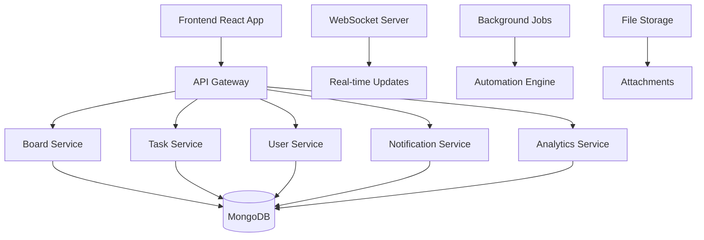

# MegaPaints Kanban Board API - Complete Documentation

## 🚀 Overview

This documentation provides comprehensive information for implementing a complete Kanban board system similar to Trello, with advanced features including task management, team collaboration, automation, and analytics.

**Base URL**: `http://localhost:3000`

## 📋 Table of Contents

1. [System Architecture](#system-architecture)
2. [Database Models](#database-models)
3. [Core Board Management](#core-board-management)
4. [Task Management](#task-management)
5. [Team Collaboration](#team-collaboration)
6. [Automation & Workflows](#automation--workflows)
7. [Analytics & Reporting](#analytics--reporting)
8. [Security & Permissions](#security--permissions)
9. [Real-time Features](#real-time-features)
10. [API Endpoints Summary](#api-endpoints-summary)
11. [Implementation Roadmap](#implementation-roadmap)

---

## 🏗️ System Architecture

### Core Components



### Technology Stack
- **Backend**: Node.js + Express.js
- **Database**: MongoDB with Mongoose ODM
- **Authentication**: JWT with refresh tokens
- **Real-time**: Socket.io for live updates
- **File Storage**: AWS S3 / Local storage
- **Background Jobs**: Bull Queue with Redis
- **Caching**: Redis for session management
- **Search**: MongoDB text search + Elasticsearch (optional)

---

## 🗄️ Database Models

### 1. Board Model
```javascript
const boardSchema = new mongoose.Schema({
  name: {
    type: String,
    required: [true, 'Board name is required'],
    trim: true,
    maxlength: [100, 'Board name cannot exceed 100 characters']
  },
  description: {
    type: String,
    trim: true,
    maxlength: [500, 'Description cannot exceed 500 characters']
  },
  cover_image: {
    url: String,
    color: String,
    brightness: String
  },
  visibility: {
    type: String,
    enum: ['private', 'team', 'public'],
    default: 'private'
  },
  workspace_id: {
    type: mongoose.Schema.Types.ObjectId,
    ref: 'Workspace',
    required: true
  },
  board_type: {
    type: String,
    enum: ['kanban', 'scrum', 'calendar', 'timeline', 'custom'],
    default: 'kanban'
  },
  columns: [{
    _id: mongoose.Schema.Types.ObjectId,
    name: { type: String, required: true, trim: true, maxlength: 50 },
    color: { type: String, default: '#6c757d' },
    position: { type: Number, required: true },
    is_active: { type: Boolean, default: true },
    wip_limit: { type: Number, default: null },
    column_type: { 
      type: String, 
      enum: ['todo', 'in_progress', 'done', 'custom'],
      default: 'custom'
    }
  }],
  settings: {
    allow_assignees: { type: Boolean, default: true },
    allow_labels: { type: Boolean, default: true },
    allow_due_dates: { type: Boolean, default: true },
    allow_attachments: { type: Boolean, default: true },
    allow_checklists: { type: Boolean, default: true },
    allow_comments: { type: Boolean, default: true },
    allow_voting: { type: Boolean, default: false },
    allow_time_tracking: { type: Boolean, default: false },
    auto_archive: { type: Boolean, default: false },
    archive_days: { type: Number, default: 30 },
    card_aging: { type: String, enum: ['disabled', 'regular', 'pirate'], default: 'disabled' }
  },
  permissions: {
    view: [{ type: String, enum: ['admin', 'member', 'observer'], default: 'member' }],
    edit: [{ type: String, enum: ['admin', 'member'], default: 'member' }],
    comment: [{ type: String, enum: ['admin', 'member', 'observer'], default: 'member' }],
    vote: [{ type: String, enum: ['admin', 'member'], default: 'member' }],
    delete: [{ type: String, enum: ['admin'], default: 'admin' }]
  },
  members: [{
    user_id: { type: mongoose.Schema.Types.ObjectId, ref: 'User', required: true },
    role: { type: String, enum: ['admin', 'member', 'observer'], default: 'member' },
    joined_at: { type: Date, default: Date.now },
    permissions: [String]
  }],
  labels: [{
    _id: mongoose.Schema.Types.ObjectId,
    name: { type: String, required: true, trim: true, maxlength: 50 },
    color: { type: String, default: '#007bff' },
    text_color: { type: String, default: '#ffffff' }
  }],
  is_active: { type: Boolean, default: true },
  is_archived: { type: Boolean, default: false },
  archived_at: Date,
  created_by: { type: mongoose.Schema.Types.ObjectId, ref: 'User', required: true },
  last_modified_by: { type: mongoose.Schema.Types.ObjectId, ref: 'User' },
  activity_log: [{
    action: String,
    description: String,
    user_id: { type: mongoose.Schema.Types.ObjectId, ref: 'User' },
    timestamp: { type: Date, default: Date.now },
    metadata: mongoose.Schema.Types.Mixed
  }]
}, {
  timestamps: { createdAt: 'created_at', updatedAt: 'updated_at' },
  toJSON: { virtuals: true },
  toObject: { virtuals: true }
});
```

### 2. Task/Card Model
```javascript
const taskSchema = new mongoose.Schema({
  title: {
    type: String,
    required: [true, 'Task title is required'],
    trim: true,
    maxlength: [200, 'Title cannot exceed 200 characters']
  },
  description: {
    type: String,
    trim: true,
    maxlength: [5000, 'Description cannot exceed 5000 characters']
  },
  board_id: {
    type: mongoose.Schema.Types.ObjectId,
    ref: 'Board',
    required: true
  },
  column_id: {
    type: mongoose.Schema.Types.ObjectId,
    required: true
  },
  position: { type: Number, required: true },
  priority: {
    type: String,
    enum: ['low', 'medium', 'high', 'urgent'],
    default: 'medium'
  },
  assignees: [{
    user_id: { type: mongoose.Schema.Types.ObjectId, ref: 'User', required: true },
    assigned_at: { type: Date, default: Date.now },
    assigned_by: { type: mongoose.Schema.Types.ObjectId, ref: 'User' }
  }],
  labels: [{
    label_id: { type: mongoose.Schema.Types.ObjectId, required: true },
    applied_at: { type: Date, default: Date.now },
    applied_by: { type: mongoose.Schema.Types.ObjectId, ref: 'User' }
  }],
  due_date: Date,
  start_date: Date,
  estimated_hours: Number,
  actual_hours: Number,
  attachments: [{
    _id: mongoose.Schema.Types.ObjectId,
    filename: String,
    original_name: String,
    file_size: Number,
    mime_type: String,
    url: String,
    uploaded_by: { type: mongoose.Schema.Types.ObjectId, ref: 'User' },
    uploaded_at: { type: Date, default: Date.now }
  }],
  checklists: [{
    _id: mongoose.Schema.Types.ObjectId,
    title: String,
    items: [{
      _id: mongoose.Schema.Types.ObjectId,
      text: String,
      completed: { type: Boolean, default: false },
      completed_by: { type: mongoose.Schema.Types.ObjectId, ref: 'User' },
      completed_at: Date
    }]
  }],
  comments: [{
    _id: mongoose.Schema.Types.ObjectId,
    text: { type: String, required: true, trim: true, maxlength: 2000 },
    author: { type: mongoose.Schema.Types.ObjectId, ref: 'User', required: true },
    created_at: { type: Date, default: Date.now },
    updated_at: Date,
    mentions: [{ type: mongoose.Schema.Types.ObjectId, ref: 'User' }],
    reactions: [{
      emoji: String,
      user_id: { type: mongoose.Schema.Types.ObjectId, ref: 'User' },
      created_at: { type: Date, default: Date.now }
    }]
  }],
  votes: [{
    user_id: { type: mongoose.Schema.Types.ObjectId, ref: 'User', required: true },
    vote_type: { type: String, enum: ['up', 'down'], required: true },
    voted_at: { type: Date, default: Date.now }
  }],
  watchers: [{ type: mongoose.Schema.Types.ObjectId, ref: 'User' }],
  is_active: { type: Boolean, default: true },
  is_archived: { type: Boolean, default: false },
  archived_at: Date,
  created_by: { type: mongoose.Schema.Types.ObjectId, ref: 'User', required: true },
  last_modified_by: { type: mongoose.Schema.Types.ObjectId, ref: 'User' },
  activity_log: [{
    action: String,
    description: String,
    user_id: { type: mongoose.Schema.Types.ObjectId, ref: 'User' },
    timestamp: { type: Date, default: Date.now },
    metadata: mongoose.Schema.Types.Mixed
  }]
}, {
  timestamps: { createdAt: 'created_at', updatedAt: 'updated_at' },
  toJSON: { virtuals: true },
  toObject: { virtuals: true }
});
```

### 3. Workspace Model
```javascript
const workspaceSchema = new mongoose.Schema({
  name: {
    type: String,
    required: [true, 'Workspace name is required'],
    trim: true,
    maxlength: [100, 'Workspace name cannot exceed 100 characters']
  },
  description: String,
  organization_id: { type: mongoose.Schema.Types.ObjectId, ref: 'Organization' },
  members: [{
    user_id: { type: mongoose.Schema.Types.ObjectId, ref: 'User', required: true },
    role: { type: String, enum: ['owner', 'admin', 'member'], default: 'member' },
    joined_at: { type: Date, default: Date.now },
    permissions: [String]
  }],
  settings: {
    allow_public_boards: { type: Boolean, default: false },
    allow_guest_access: { type: Boolean, default: false },
    default_board_visibility: { type: String, enum: ['private', 'team', 'public'], default: 'private' }
  },
  is_active: { type: Boolean, default: true },
  created_by: { type: mongoose.Schema.Types.ObjectId, ref: 'User', required: true }
}, {
  timestamps: true,
  toJSON: { virtuals: true },
  toObject: { virtuals: true }
});
```

### 4. Automation Model
```javascript
const automationSchema = new mongoose.Schema({
  name: {
    type: String,
    required: true,
    trim: true,
    maxlength: 100
  },
  description: String,
  board_id: { type: mongoose.Schema.Types.ObjectId, ref: 'Board', required: true },
  trigger: {
    type: { type: String, enum: ['card_created', 'card_moved', 'card_updated', 'due_date', 'custom'], required: true },
    conditions: mongoose.Schema.Types.Mixed
  },
  actions: [{
    type: { type: String, enum: ['move_card', 'add_label', 'assign_user', 'set_due_date', 'add_comment', 'send_notification'], required: true },
    parameters: mongoose.Schema.Types.Mixed
  }],
  is_active: { type: Boolean, default: true },
  created_by: { type: mongoose.Schema.Types.ObjectId, ref: 'User', required: true },
  last_run: Date,
  run_count: { type: Number, default: 0 }
}, {
  timestamps: true,
  toJSON: { virtuals: true },
  toObject: { virtuals: true }
});
```

---

## 🎯 Core Board Management APIs

### 1. Board CRUD Operations

#### Create Board
**POST** `/api/kanban/boards`

**Headers:** `Authorization: Bearer <access_token>`

**Request Body:**
```json
{
  "name": "Project Alpha",
  "description": "Main project tracking board",
  "workspace_id": "68d2bcf322e5515f73468f21",
  "board_type": "kanban",
  "visibility": "team",
  "cover_image": {
    "color": "#007bff",
    "brightness": "dark"
  },
  "columns": [
    {
      "name": "To Do",
      "color": "#6c757d",
      "position": 0,
      "column_type": "todo",
      "wip_limit": null
    },
    {
      "name": "In Progress",
      "color": "#007bff",
      "position": 1,
      "column_type": "in_progress",
      "wip_limit": 5
    },
    {
      "name": "Done",
      "color": "#28a745",
      "position": 2,
      "column_type": "done",
      "wip_limit": null
    }
  ],
  "settings": {
    "allow_assignees": true,
    "allow_labels": true,
    "allow_due_dates": true,
    "allow_attachments": true,
    "allow_checklists": true,
    "allow_comments": true,
    "allow_voting": false,
    "allow_time_tracking": true,
    "auto_archive": false,
    "archive_days": 30,
    "card_aging": "regular"
  },
  "labels": [
    {
      "name": "High Priority",
      "color": "#dc3545",
      "text_color": "#ffffff"
    },
    {
      "name": "Bug",
      "color": "#ffc107",
      "text_color": "#000000"
    }
  ]
}
```

**Response:**
```json
{
  "status": "success",
  "message": "Board created successfully",
  "data": {
    "board": {
      "_id": "68d2bcf322e5515f73468f30",
      "name": "Project Alpha",
      "description": "Main project tracking board",
      "workspace_id": "68d2bcf322e5515f73468f21",
      "board_type": "kanban",
      "visibility": "team",
      "cover_image": {
        "color": "#007bff",
        "brightness": "dark"
      },
      "columns": [...],
      "settings": {...},
      "labels": [...],
      "members": [
        {
          "user_id": "68d2bcf322e5515f73468f0c",
          "role": "admin",
          "joined_at": "2025-10-01T00:00:00.000Z",
          "permissions": ["view", "edit", "comment", "vote", "delete"]
        }
      ],
      "is_active": true,
      "created_by": "68d2bcf322e5515f73468f0c",
      "created_at": "2025-10-01T00:00:00.000Z"
    }
  }
}
```

#### Get Boards
**GET** `/api/kanban/boards`

**Query Parameters:**
- `page` (optional): Page number (default: 1)
- `limit` (optional): Items per page (default: 20, max: 100)
- `search` (optional): Search term for name, description
- `workspace_id` (optional): Filter by workspace
- `board_type` (optional): Filter by board type
- `visibility` (optional): Filter by visibility
- `is_active` (optional): Filter by active status
- `member_id` (optional): Filter by member participation

#### Update Board
**PUT** `/api/kanban/boards/:id`

#### Delete Board
**DELETE** `/api/kanban/boards/:id`

#### Archive Board
**POST** `/api/kanban/boards/:id/archive`

#### Restore Board
**POST** `/api/kanban/boards/:id/restore`

---

## 📋 Task Management APIs

### 1. Task CRUD Operations

#### Create Task
**POST** `/api/kanban/tasks`

**Request Body:**
```json
{
  "title": "Implement user authentication",
  "description": "Add JWT-based authentication system with refresh tokens",
  "board_id": "68d2bcf322e5515f73468f30",
  "column_id": "68d2bcf322e5515f73468f31",
  "position": 0,
  "priority": "high",
  "assignees": ["68d2bcf322e5515f73468f0c"],
  "labels": ["68d2bcf322e5515f73468f40"],
  "due_date": "2025-10-15T23:59:59.000Z",
  "start_date": "2025-10-01T00:00:00.000Z",
  "estimated_hours": 8,
  "checklists": [
    {
      "title": "Authentication Tasks",
      "items": [
        {
          "text": "Create JWT middleware",
          "completed": false
        },
        {
          "text": "Implement login endpoint",
          "completed": false
        }
      ]
    }
  ]
}
```

#### Get Tasks
**GET** `/api/kanban/tasks`

**Query Parameters:**
- `board_id` (required): Board ID
- `column_id` (optional): Filter by column
- `assignee_id` (optional): Filter by assignee
- `label_id` (optional): Filter by label
- `priority` (optional): Filter by priority
- `due_date_from` (optional): Filter by due date range
- `due_date_to` (optional): Filter by due date range
- `search` (optional): Search in title and description

#### Update Task
**PUT** `/api/kanban/tasks/:id`

#### Move Task
**POST** `/api/kanban/tasks/:id/move`

**Request Body:**
```json
{
  "column_id": "68d2bcf322e5515f73468f32",
  "position": 2
}
```

#### Archive Task
**POST** `/api/kanban/tasks/:id/archive`

### 2. Task Comments

#### Add Comment
**POST** `/api/kanban/tasks/:id/comments`

**Request Body:**
```json
{
  "text": "Great progress! Keep it up!",
  "mentions": ["68d2bcf322e5515f73468f0c"]
}
```

#### Update Comment
**PUT** `/api/kanban/tasks/:id/comments/:commentId`

#### Delete Comment
**DELETE** `/api/kanban/tasks/:id/comments/:commentId`

#### Add Reaction
**POST** `/api/kanban/tasks/:id/comments/:commentId/reactions`

**Request Body:**
```json
{
  "emoji": "👍"
}
```

### 3. Task Attachments

#### Upload Attachment
**POST** `/api/kanban/tasks/:id/attachments`

**Content-Type:** `multipart/form-data`

**Form Data:**
- `file`: File to upload
- `description`: Optional description

#### Delete Attachment
**DELETE** `/api/kanban/tasks/:id/attachments/:attachmentId`

---

## 👥 User Management APIs

The User Management system provides comprehensive APIs for managing users within the Kanban system, including workspace context, role management, and activity tracking.

### 🎯 User Operations

#### 1. Get All Users
**GET** `/api/kanban/users`

**Headers:** `Authorization: Bearer <access_token>`

**Query Parameters:**
- `page` (optional): Page number (default: 1)
- `limit` (optional): Items per page (default: 20, max: 100)
- `search` (optional): Search term for username, email, first_name, last_name
- `workspace_id` (optional): Filter by workspace ID
- `role` (optional): Filter by role (admin, member, observer)
- `is_active` (optional): Filter by active status (true/false)

**Response:**
```json
{
  "status": "success",
  "data": {
    "users": [
      {
        "_id": "68d2bcf322e5515f73468f0c",
        "username": "john_doe",
        "email": "john@megapaints.com",
        "first_name": "John",
        "last_name": "Doe",
        "phone": "+91-98765-43210",
        "company": "MegaPaints",
        "designation": "Developer",
        "branches": [
          {
            "_id": "68d2bcf322e5515f73468f21",
            "name": "Main Branch",
            "code": "MAIN"
          }
        ],
        "is_active": true,
        "createdAt": "2025-10-01T00:00:00.000Z",
        "updatedAt": "2025-10-01T00:00:00.000Z"
      }
    ],
    "pagination": {
      "page": 1,
      "limit": 20,
      "total": 1,
      "pages": 1
    },
    "filters": {
      "search": null,
      "workspace_id": null,
      "role": null,
      "is_active": null
    }
  }
}
```

#### 2. Get User by ID
**GET** `/api/kanban/users/:id`

**Headers:** `Authorization: Bearer <access_token>`

**Response:**
```json
{
  "status": "success",
  "data": {
    "user": {
      "_id": "68d2bcf322e5515f73468f0c",
      "username": "john_doe",
      "email": "john@megapaints.com",
      "first_name": "John",
      "last_name": "Doe",
      "phone": "+91-98765-43210",
      "company": "MegaPaints",
      "designation": "Developer",
      "branches": [...],
      "is_active": true,
      "workspace_memberships": [
        {
          "workspace_id": "68d2bcf322e5515f73468f50",
          "workspace_name": "Development Team",
          "role": "member",
          "joined_at": "2025-10-01T00:00:00.000Z"
        }
      ],
      "board_memberships": [
        {
          "board_id": "68d2bcf322e5515f73468f30",
          "board_name": "Project Alpha",
          "board_type": "kanban",
          "role": "member",
          "joined_at": "2025-10-01T00:00:00.000Z"
        }
      ]
    }
  }
}
```

#### 3. Create User
**POST** `/api/kanban/users`

**Headers:** `Authorization: Bearer <access_token>`

**Request Body:**
```json
{
  "username": "jane_smith",
  "email": "jane@megapaints.com",
  "password": "password123",
  "first_name": "Jane",
  "last_name": "Smith",
  "phone": "+91-98765-43210",
  "company": "MegaPaints",
  "designation": "Designer",
  "workspace_id": "68d2bcf322e5515f73468f50",
  "initial_role": "member"
}
```

**Response:**
```json
{
  "status": "success",
  "message": "User created successfully",
  "data": {
    "user": {
      "_id": "68d2bcf322e5515f73468f51",
      "username": "jane_smith",
      "email": "jane@megapaints.com",
      "first_name": "Jane",
      "last_name": "Smith",
      "phone": "+91-98765-43210",
      "company": "MegaPaints",
      "designation": "Designer",
      "roles": ["user"],
      "permissions": ["boards:read", "tasks:read"],
      "is_active": true,
      "createdAt": "2025-10-01T00:00:00.000Z"
    }
  }
}
```

#### 4. Update User
**PUT** `/api/kanban/users/:id`

**Headers:** `Authorization: Bearer <access_token>`

**Request Body:** (All fields are optional)
```json
{
  "first_name": "Jane Updated",
  "last_name": "Smith Updated",
  "phone": "+91-99999-88888",
  "company": "New Company",
  "designation": "Senior Designer",
  "is_active": true,
  "permissions": ["boards:read", "boards:create", "tasks:read", "tasks:create"]
}
```

**Response:**
```json
{
  "status": "success",
  "message": "User updated successfully",
  "data": {
    "user": {
      "_id": "68d2bcf322e5515f73468f51",
      "username": "jane_smith",
      "email": "jane@megapaints.com",
      "first_name": "Jane Updated",
      "last_name": "Smith Updated",
      "phone": "+91-99999-88888",
      "company": "New Company",
      "designation": "Senior Designer",
      "is_active": true,
      "updatedAt": "2025-10-01T00:00:00.000Z"
    }
  }
}
```

#### 5. Delete User
**DELETE** `/api/kanban/users/:id`

**Headers:** `Authorization: Bearer <access_token>`

**Response:**
```json
{
  "status": "success",
  "message": "User deactivated successfully",
  "details": "User has been removed from all workspaces and boards"
}
```

#### 6. Get User Activity
**GET** `/api/kanban/users/:id/activity`

**Headers:** `Authorization: Bearer <access_token>`

**Query Parameters:**
- `page` (optional): Page number (default: 1)
- `limit` (optional): Items per page (default: 20, max: 100)

**Response:**
```json
{
  "status": "success",
  "data": {
    "user": {
      "_id": "68d2bcf322e5515f73468f0c",
      "username": "john_doe",
      "email": "john@megapaints.com",
      "first_name": "John",
      "last_name": "Doe",
      "board_memberships": [
        {
          "_id": "68d2bcf322e5515f73468f30",
          "name": "Project Alpha"
        }
      ],
      "total_boards": 1,
      "activity_summary": {
        "total_tasks_assigned": 15,
        "total_comments": 42,
        "last_activity": "2025-10-01T00:00:00.000Z"
      }
    }
  }
}
```

#### 7. Invite User to Workspace
**POST** `/api/kanban/users/:id/invite-to-workspace`

**Headers:** `Authorization: Bearer <access_token>`

**Request Body:**
```json
{
  "workspace_id": "68d2bcf322e5515f73468f50",
  "role": "member"
}
```

**Response:**
```json
{
  "status": "success",
  "message": "User invited to workspace successfully",
  "data": {
    "user": {
      "_id": "68d2bcf322e5515f73468f0c",
      "username": "john_doe",
      "email": "john@megapaints.com",
      "first_name": "John",
      "last_name": "Doe"
    },
    "workspace": {
      "_id": "68d2bcf322e5515f73468f50",
      "name": "Development Team",
      "role": "member"
    }
  }
}
```

## 👥 Team Collaboration APIs

### 1. Board Members

#### Add Member
**POST** `/api/kanban/boards/:id/members`

**Request Body:**
```json
{
  "user_id": "68d2bcf322e5515f73468f0c",
  "role": "member",
  "permissions": ["view", "edit", "comment"]
}
```

#### Update Member Role
**PUT** `/api/kanban/boards/:id/members/:userId`

#### Remove Member
**DELETE** `/api/kanban/boards/:id/members/:userId`

#### Get Members
**GET** `/api/kanban/boards/:id/members`

### 2. Task Assignments

#### Assign Task
**POST** `/api/kanban/tasks/:id/assign`

**Request Body:**
```json
{
  "user_id": "68d2bcf322e5515f73468f0c"
}
```

#### Unassign Task
**DELETE** `/api/kanban/tasks/:id/assign/:userId`

### 3. Watching Tasks

#### Watch Task
**POST** `/api/kanban/tasks/:id/watch`

#### Unwatch Task
**DELETE** `/api/kanban/tasks/:id/watch`

---

## 🤖 Automation & Workflows APIs

### 1. Automation Rules

#### Create Automation
**POST** `/api/kanban/automations`

**Request Body:**
```json
{
  "name": "Move to Done when Checklist Complete",
  "description": "Automatically move task to Done column when all checklist items are completed",
  "board_id": "68d2bcf322e5515f73468f30",
  "trigger": {
    "type": "card_updated",
    "conditions": {
      "field": "checklists",
      "operator": "all_completed"
    }
  },
  "actions": [
    {
      "type": "move_card",
      "parameters": {
        "column_id": "68d2bcf322e5515f73468f33"
      }
    }
  ]
}
```

#### Get Automations
**GET** `/api/kanban/automations`

#### Update Automation
**PUT** `/api/kanban/automations/:id`

#### Delete Automation
**DELETE** `/api/kanban/automations/:id`

#### Test Automation
**POST** `/api/kanban/automations/:id/test`

### 2. Workflow Templates

#### Get Templates
**GET** `/api/kanban/templates`

#### Apply Template
**POST** `/api/kanban/boards/:id/apply-template`

**Request Body:**
```json
{
  "template_id": "68d2bcf322e5515f73468f50"
}
```

---

## 📊 Analytics & Reporting APIs

### 1. Board Analytics

#### Get Board Analytics
**GET** `/api/kanban/boards/:id/analytics`

**Query Parameters:**
- `period` (optional): `7d`, `30d`, `90d`, `1y` (default: `30d`)
- `metric` (optional): `tasks`, `velocity`, `cycle_time`, `lead_time`

**Response:**
```json
{
  "status": "success",
  "data": {
    "metrics": {
      "total_tasks": 150,
      "completed_tasks": 120,
      "in_progress_tasks": 20,
      "overdue_tasks": 5,
      "average_cycle_time": 3.2,
      "average_lead_time": 5.8,
      "velocity": 15.5
    },
    "charts": {
      "task_distribution": [...],
      "completion_trend": [...],
      "team_performance": [...]
    },
    "insights": [
      "Tasks are completing 20% faster this month",
      "Column 'In Progress' has reached WIP limit 5 times"
    ]
  }
}
```

#### Get Team Performance
**GET** `/api/kanban/analytics/team-performance`

#### Get Workload Distribution
**GET** `/api/kanban/analytics/workload`

### 2. Reports

#### Generate Report
**POST** `/api/kanban/reports/generate`

**Request Body:**
```json
{
  "board_id": "68d2bcf322e5515f73468f30",
  "report_type": "sprint_summary",
  "period": "30d",
  "format": "pdf",
  "include_charts": true
}
```

#### Get Report
**GET** `/api/kanban/reports/:id`

---

## 🔒 Security & Permissions

### 1. Permission System

#### Permission Levels
- **Owner**: Full control over workspace
- **Admin**: Manage boards, members, settings
- **Member**: Create/edit tasks, comment, vote
- **Observer**: View only, comment (if enabled)

#### Permission Checks
```javascript
// Middleware for permission checking
const checkBoardPermission = (permission) => {
  return async (req, res, next) => {
    try {
      const board = await Board.findById(req.params.boardId);
      const userRole = board.members.find(m => m.user_id.toString() === req.user._id.toString());
      
      if (!userRole || !userRole.permissions.includes(permission)) {
        return res.status(403).json({
          status: 'error',
          code: 403,
          message: 'Insufficient permissions',
          details: `Required permission: ${permission}`
        });
      }
      
      req.board = board;
      req.userRole = userRole;
      next();
    } catch (error) {
      res.status(500).json({
        status: 'error',
        code: 500,
        message: 'Permission check failed',
        details: error.message
      });
    }
  };
};
```

### 2. Data Validation

#### Input Validation
```javascript
const validateTask = [
  body('title')
    .trim()
    .isLength({ min: 1, max: 200 })
    .withMessage('Title must be between 1 and 200 characters'),
  body('description')
    .optional()
    .isLength({ max: 5000 })
    .withMessage('Description cannot exceed 5000 characters'),
  body('priority')
    .optional()
    .isIn(['low', 'medium', 'high', 'urgent'])
    .withMessage('Invalid priority level'),
  body('due_date')
    .optional()
    .isISO8601()
    .withMessage('Invalid due date format')
];
```

### 3. Rate Limiting

#### API Rate Limits
- **General APIs**: 100 requests per 15 minutes
- **File Upload**: 10 requests per 15 minutes
- **Search APIs**: 50 requests per 15 minutes
- **Real-time Events**: 200 events per 15 minutes

---

## ⚡ Real-time Features

### 1. WebSocket Events

#### Connection
```javascript
// Client-side connection
const socket = io('http://localhost:3000', {
  auth: {
    token: localStorage.getItem('accessToken')
  }
});
```

#### Board Events
```javascript
// Listen for board updates
socket.on('board:updated', (data) => {
  console.log('Board updated:', data);
  // Update UI
});

// Listen for task updates
socket.on('task:created', (data) => {
  console.log('New task created:', data);
  // Add task to UI
});

socket.on('task:moved', (data) => {
  console.log('Task moved:', data);
  // Update task position
});

socket.on('task:updated', (data) => {
  console.log('Task updated:', data);
  // Update task in UI
});

// Listen for comments
socket.on('comment:added', (data) => {
  console.log('New comment:', data);
  // Add comment to UI
});
```

#### Server-side Event Emission
```javascript
// Emit board update
io.to(`board:${boardId}`).emit('board:updated', {
  board: updatedBoard,
  user: req.user.username,
  timestamp: new Date()
});

// Emit task update
io.to(`board:${boardId}`).emit('task:updated', {
  task: updatedTask,
  user: req.user.username,
  timestamp: new Date()
});
```

### 2. Live Collaboration

#### Cursor Tracking
```javascript
// Track user cursors
socket.on('cursor:move', (data) => {
  socket.to(`board:${boardId}`).emit('cursor:move', {
    userId: socket.userId,
    position: data.position,
    timestamp: Date.now()
  });
});
```

#### Live Editing
```javascript
// Real-time text editing
socket.on('task:edit:start', (data) => {
  socket.to(`board:${boardId}`).emit('task:edit:start', {
    taskId: data.taskId,
    userId: socket.userId,
    field: data.field
  });
});

socket.on('task:edit:content', (data) => {
  socket.to(`board:${boardId}`).emit('task:edit:content', {
    taskId: data.taskId,
    userId: socket.userId,
    content: data.content,
    timestamp: Date.now()
  });
});
```

---

## 📊 API Endpoints Summary

### User Management (7 endpoints)
- `GET /api/kanban/users` - Get all users
- `GET /api/kanban/users/:id` - Get user by ID
- `POST /api/kanban/users` - Create user
- `PUT /api/kanban/users/:id` - Update user
- `DELETE /api/kanban/users/:id` - Delete user
- `GET /api/kanban/users/:id/activity` - Get user activity
- `POST /api/kanban/users/:id/invite-to-workspace` - Invite user to workspace

### Board Management (12 endpoints)
- `POST /api/kanban/boards` - Create board
- `GET /api/kanban/boards` - Get boards
- `GET /api/kanban/boards/:id` - Get board by ID
- `PUT /api/kanban/boards/:id` - Update board
- `DELETE /api/kanban/boards/:id` - Delete board
- `POST /api/kanban/boards/:id/archive` - Archive board
- `POST /api/kanban/boards/:id/restore` - Restore board
- `GET /api/kanban/boards/:id/members` - Get board members
- `POST /api/kanban/boards/:id/members` - Add member
- `PUT /api/kanban/boards/:id/members/:userId` - Update member role
- `DELETE /api/kanban/boards/:id/members/:userId` - Remove member
- `GET /api/kanban/boards/:id/analytics` - Get board analytics

### Task Management (15 endpoints)
- `POST /api/kanban/tasks` - Create task
- `GET /api/kanban/tasks` - Get tasks
- `GET /api/kanban/tasks/:id` - Get task by ID
- `PUT /api/kanban/tasks/:id` - Update task
- `DELETE /api/kanban/tasks/:id` - Delete task
- `POST /api/kanban/tasks/:id/move` - Move task
- `POST /api/kanban/tasks/:id/archive` - Archive task
- `POST /api/kanban/tasks/:id/assign` - Assign task
- `DELETE /api/kanban/tasks/:id/assign/:userId` - Unassign task
- `POST /api/kanban/tasks/:id/watch` - Watch task
- `DELETE /api/kanban/tasks/:id/watch` - Unwatch task
- `POST /api/kanban/tasks/:id/comments` - Add comment
- `PUT /api/kanban/tasks/:id/comments/:commentId` - Update comment
- `DELETE /api/kanban/tasks/:id/comments/:commentId` - Delete comment
- `POST /api/kanban/tasks/:id/comments/:commentId/reactions` - Add reaction

### File Management (4 endpoints)
- `POST /api/kanban/tasks/:id/attachments` - Upload attachment
- `GET /api/kanban/tasks/:id/attachments` - Get attachments
- `DELETE /api/kanban/tasks/:id/attachments/:attachmentId` - Delete attachment
- `GET /api/kanban/attachments/:attachmentId/download` - Download attachment

### Automation (6 endpoints)
- `POST /api/kanban/automations` - Create automation
- `GET /api/kanban/automations` - Get automations
- `GET /api/kanban/automations/:id` - Get automation by ID
- `PUT /api/kanban/automations/:id` - Update automation
- `DELETE /api/kanban/automations/:id` - Delete automation
- `POST /api/kanban/automations/:id/test` - Test automation

### Analytics & Reports (8 endpoints)
- `GET /api/kanban/analytics/team-performance` - Team performance
- `GET /api/kanban/analytics/workload` - Workload distribution
- `GET /api/kanban/analytics/velocity` - Velocity metrics
- `GET /api/kanban/analytics/cycle-time` - Cycle time analysis
- `POST /api/kanban/reports/generate` - Generate report
- `GET /api/kanban/reports` - Get reports
- `GET /api/kanban/reports/:id` - Get report by ID
- `DELETE /api/kanban/reports/:id` - Delete report

### Templates (4 endpoints)
- `GET /api/kanban/templates` - Get templates
- `GET /api/kanban/templates/:id` - Get template by ID
- `POST /api/kanban/boards/:id/apply-template` - Apply template
- `POST /api/kanban/templates` - Create template

### Search & Filtering (3 endpoints)
- `GET /api/kanban/search/tasks` - Search tasks
- `GET /api/kanban/search/boards` - Search boards
- `GET /api/kanban/filters/suggestions` - Get filter suggestions

**Total: 59 Kanban-specific API endpoints**

---

## 🚀 Implementation Roadmap

### Phase 1: Core Foundation (Week 1-2)
- [ ] Database models setup
- [ ] Basic board CRUD operations
- [ ] Basic task CRUD operations
- [ ] Authentication & authorization
- [ ] Basic API documentation

### Phase 2: Task Management (Week 3-4)
- [ ] Task comments system
- [ ] File attachments
- [ ] Checklists
- [ ] Due dates & reminders
- [ ] Task assignments

### Phase 3: Collaboration (Week 5-6)
- [ ] Board members management
- [ ] Real-time updates (WebSocket)
- [ ] Live cursors
- [ ] Notifications system
- [ ] Activity logging

### Phase 4: Advanced Features (Week 7-8)
- [ ] Automation rules
- [ ] Workflow templates
- [ ] Advanced search & filtering
- [ ] Labels & categories
- [ ] Voting system

### Phase 5: Analytics & Reporting (Week 9-10)
- [ ] Board analytics
- [ ] Team performance metrics
- [ ] Report generation
- [ ] Data visualization
- [ ] Export functionality

### Phase 6: Polish & Optimization (Week 11-12)
- [ ] Performance optimization
- [ ] Security hardening
- [ ] Error handling
- [ ] Testing & QA
- [ ] Documentation completion

---

## 🔧 Development Standards

### 1. Code Standards
- **ESLint**: Airbnb JavaScript Style Guide
- **Prettier**: Code formatting
- **JSDoc**: API documentation
- **TypeScript**: Type safety (optional)

### 2. Testing Standards
- **Unit Tests**: Jest with 80%+ coverage
- **Integration Tests**: Supertest for API testing
- **E2E Tests**: Cypress for critical flows
- **Performance Tests**: Artillery for load testing

### 3. Security Standards
- **OWASP Top 10** compliance
- **Input validation** on all endpoints
- **SQL injection** prevention
- **XSS protection**
- **CSRF tokens**
- **Rate limiting**
- **Audit logging**

### 4. Performance Standards
- **Response time**: < 200ms for 95% of requests
- **Database queries**: Optimized with indexes
- **Caching**: Redis for session & frequently accessed data
- **File uploads**: Chunked uploads for large files
- **Real-time**: < 100ms latency for WebSocket events

---

## 📝 Next Steps

1. **Review and approve** this documentation
2. **Set up development environment** with all dependencies
3. **Create database models** and migrations
4. **Implement Phase 1** core foundation
5. **Set up CI/CD pipeline** for automated testing
6. **Begin iterative development** following the roadmap

This comprehensive Kanban board system will provide all the features needed to compete with Trello while maintaining enterprise-grade security and performance standards.
